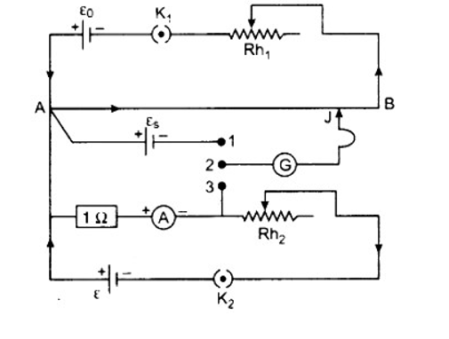
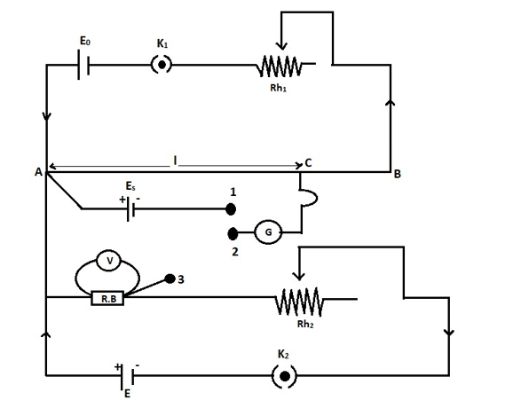

<h3>1. Calibration of Ammeter </h3> 
As mentioned above, we will use a suitable stable DC supply voltage to avoid the errors in calibration which do not produce voltage fluctuations during the entire experiment. A rheostat is used for adjusting the magnitude of the current flowing through the entire circuit. Also, a standard resistance ‘R’ of suitable value with sufficient current-carrying capacity is placed in series with the ammeter (which is under calibration) for getting a voltage parameter which relates to the current flowing in the circuit. 
Now after the power is turned ON, a current ‘I’ flows through the entire circuit and with this current flow reading will be generated by the ammeter present in the loop. Also, a voltage drop will take place across the standard resistance ‘R’ because of this current flow. 
Now we will use a potentiometer to measure the voltage across the standard resistor and then us ohms law to calculate the current through the standard resistance. 
That is the current       
 <h4>                     

  I=V/R

 </h4>
Where, 
            V = Voltage across the standard resistor   
            R = Resistance of standard resistor 
  
Since we are using the standard resistor, the resistance will be accurately known and the voltage across the standard resistor is measured by the potentiometer. The calculated value will be the accurate value of the current flowing through the loop. Then compare this calculated value with ammeter reading to check the accuracy of the ammeter. 
 

  
The connecting are self-explanarory.In this circuit experiment the same current as simultaneously measured with the given instrument as potentiometer wire, when emf 'E' of a Denial cell is balanced on it. then we have 

 E=L1*x

where, 
'x' is the potential gradient along the potentiometer 
where, 

  x=E/L1         ...........................(1)

let l2 be the balancing length of potentiometer wire,where potential difference V2 across resistance R between M and N is balanced on it. 
Then we have , 

  V2=xL2        ............................(2)

from 1 and 2 we have, 

  V2=E*(L2/L1)   ............................(3)

 here

  I2=V2          ............................(4)

Substituting value of V2 from equation 3 and 4 

  I2 = E(L2/L1) ............................(5)

The error in the value observed by the ammeter can be written as,

  ΔI=I2−I1 

<h3>2. Calibration of Voltmeter </h3>
Here we are calibrating a voltmeter. The main errors that are observed in a voltmeter reading are: 
1. Mechanical errors due to manufacturing defects.  
2. Parallax error  
3. Asymmetry in the voltmeter spring.<pr> 
The potentiometer can be used to increase the accuracy in the value of potential difference. <pr>
When we use a potentiometer to check the errors in the observations of a voltmeter, it is called the calibration of the voltmeter.  
The figure shows the diagram for the calibration of the voltmeter using a potentiometer. 
It consists of a primary circuit that is shown in the above section. The positive terminal of the standard cell is connected to point A in the secondary circuit. Point A is the high potential end. The negative terminal of the standard cell is connected to the first terminal of a two-way key. As shown in the figure, the cell E, key, rheostat, and resistance box is connected in a series connection. One end of the resistance box (high potential end) is connected to the point of high potential AA and the point of the resistance box having low potential is connected to the third terminal of a two-way key.   
The voltmeter that needs the calibration is connected across the resistance box. The central terminal of the two-way key is connected to a galvanometer. And the other end of the galvanometer is connected with a jockey.   
After completing the primary circuit as shown in the diagram, insert the plug between the terminal 1 and the terminal 2. Now we have to find the balancing length for the standard cell Es.  
Let lo be the balancing length for Es.  
<h4>                     

  Es=klo

 </h4>
Where,   k is the potential gradient from the above equation  we can write also the above equation, 
<h4>                     

  k=Eslo 

 </h4>
 
 
 
 
We can find k it by standardizing the cell.  
Now we have to remove the plug between the terminals 1 and 2. And we have to insert it between the terminal 2 and 3. After closing the key K2 stake the suitable resistance from the resistance box. Using the rheostat adjust the current passing through the resistance and note down the deflection of the voltmeter. Let it be Vv. This value will not be accurate, it contains an error. The real value of potential difference can be obtained by the potentiometer. We have to find the corresponding balancing length. Let this balancing length be l2. By applying the principle of the potentiometer, the actual value of potential difference can be written as,  
<h4>                     

  V′=Kl2 

 </h4>
 We know that the value of k is
 <h4>                     

  k=Eslo 

 </h4>
 Substituting, we get 
 <h4>                     

   V′=(E slo) l2 

 </h4>
The error in the value observed by the voltmeter can be written as, 
  <h4>                     

   ΔV=V−V′ 

 </h4>
Using the resistance box and the rheostat, different values of voltmeter can be observed. The corresponding potential difference can also be obtained by using the potentiometer. The difference between the observation of the voltmeter and the potential difference by the potentiometer can be used to find the error. 

